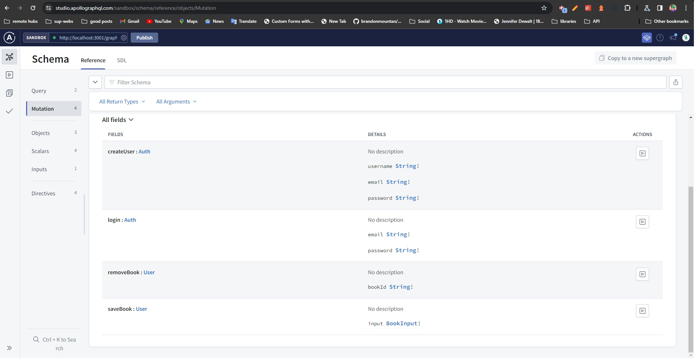
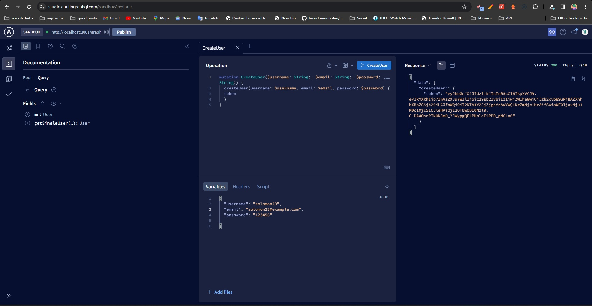
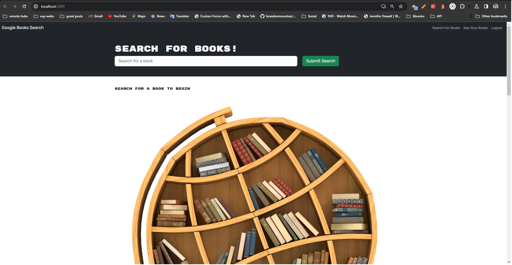
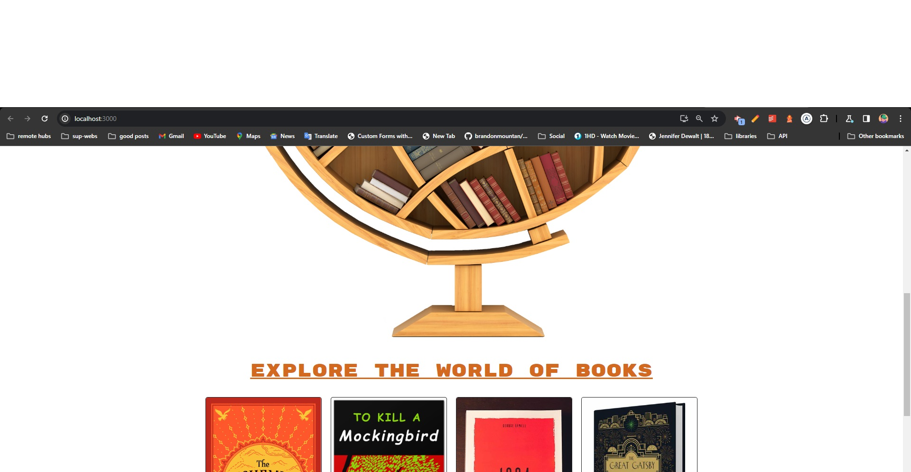
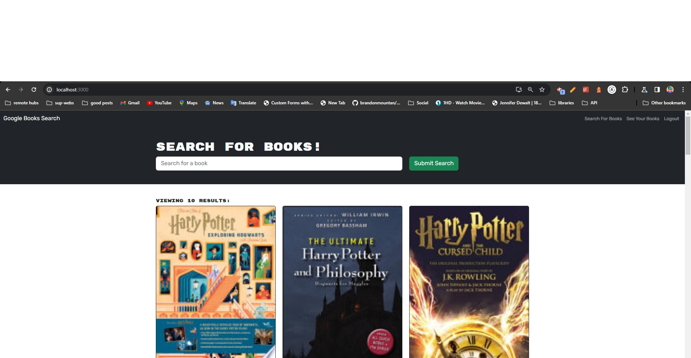
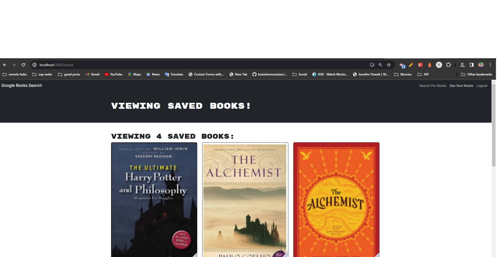
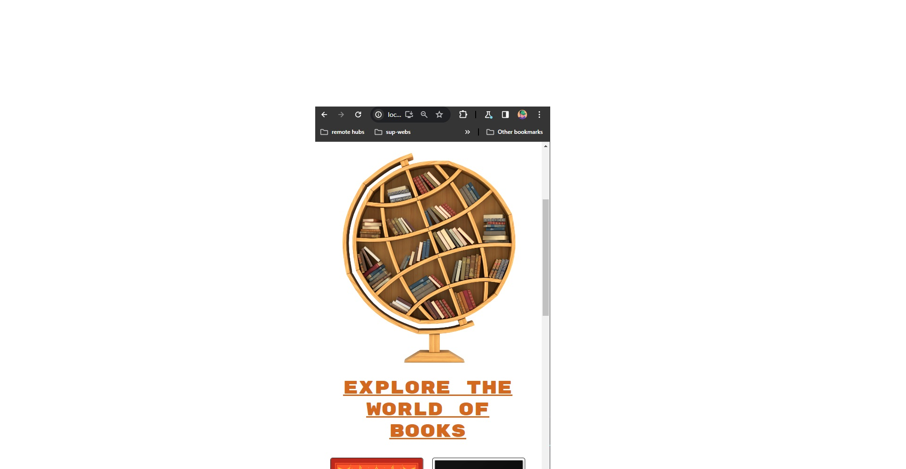

# BookShelf
A book finder MERN app that allows users to search for books using the Google Books API and save them to a database. Users can also view books saved by other users and delete books from their saved list.

## Table of Contents
* [Features](#features)
* [Getting Started](#getting-started)
* [Installation](#installation)
* [Usage](#usage)
* [Technologies](#technologies)
* [License](#license)
* [Deployed Link](#deployed)
* [Screenshot](#screenshot)
* [Contributing](#contributing)
* [Credits](#credits)
* [Contact](#contact)

## Features
* Search for books using the Google Books API
* Save books to a database
* View books saved by other users
* Delete books from your saved list

## Getting Started
To get started, use the deployed link in the [Deployed Link](#deployed) section or clone the repository and run ```npm install``` to install the required dependencies.
## Installation
To install dependencies, run the following:
```you can follow scripts in package.json file inside the root folder: bookshelf```
```npm install```

## Usage
After downloading the files and installing the dependencies, run ```npm run develop``` to start the application.

## Technologies
* React
* Node.js
* Apollo Server
* GraphQL
* Express.js
* MongoDB
* Mongoose
* Google Books API
* Bootstrap

## License
This repository is licensed under the MIT license.
## Deployed
https://bookshelf-2021.herokuapp.com/

## Screenshot








## Contributing
## Contributing
[](https://github.com/solowon27/BookShelf)

To contribute to BookShelf, clone this repo locally and commit your code on a separate branch.

## Credits
* [React](https://reactjs.org/)
* [Node.js](https://nodejs.org/en/)
* [Apollo Server](https://www.apollographql.com/docs/apollo-server/)
* [GraphQL](https://graphql.org/)
* [Express.js](https://expressjs.com/)
* [MongoDB](https://www.mongodb.com/)
* [Mongoose](https://mongoosejs.com/)
* [Google Books API](https://developers.google.com/books)
* [Bootstrap](https://getbootstrap.com/)

## Contact
If you want to contact me you can reach me at[solowon27@hotmail.com] or [https://www.linkedin.com/in/solomon-tegegne-7b347027a/]. 

